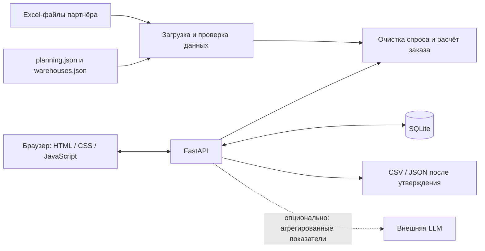

# Finplex — помощник менеджера по закупкам

**HackAlem AI · кейс ТОО «Электрокомплект» (ekt.kz): автоматическое формирование заказов поставщикам.**

Finplex превращает Excel-выгрузки продаж, остатков и поставок в объяснимые рекомендации по пополнению склада. Основной пользователь — менеджер отдела закупа: вместо ручного объединения таблиц он получает список товаров, количество, срочность и обоснование, проверяет рекомендации и утверждает заказ.

Проект направлен на сокращение времени расчёта и снижение риска дефицита и избыточных запасов. Экономический эффект ещё не измерен в эксплуатации у партнёра.

**Статус:** работающий локальный прототип с двумя наборами поставщиков, сохранением заказов и экспортом CSV/JSON. Для основного сценария внешний AI-сервис и платные ключи не требуются. Публичная ссылка на развёрнутое приложение не предоставлена; порядок локального запуска приведён ниже.

## Что реализовано

| Возможность | Результат для менеджера |
|---|---|
| Загрузка данных Systeme Electric и ИЭК | Используются все шесть Excel-файлов каждого поставщика: продажи, история документов, остатки, путь, партии и сезонность |
| Прогноз регулярного спроса | Учитываются календарная сезонность, устойчивый рост или явно заданный прогноз прироста |
| Очистка разовых крупных продаж | Выбросы исключаются из регулярной потребности; при наличии обезличенного ID учитываются несколько документов одного клиента за день |
| Компенсация stockout | Подтверждённые дни отсутствия товара увеличивают оценку спроса; нулевые продажи сами по себе не считаются stockout |
| Расчёт пополнения | Учитываются свободные остатки, товары в пути, даты поступления, сроки поставки, страховой запас, минимум и кратность партии |
| Выбор поставщика, категории и склада | Поставщики рассчитываются отдельно; отдельные склады доступны после загрузки их данных через `warehouses.json` |
| Работа с рекомендациями | Поиск, приоритет дефицита, график истории/прогноза, бюджет, правка количества и цены, уточнение отсутствующих артикула и единицы |
| Проверка сценариев | Сравнение базового расчёта с задержкой поставки и ростом спроса на 20% |
| Согласование заказа | Выбор строк → сохранённый черновик → проверка ответственным → утверждение → экспорт |
| Сохранённые заказы | Повторное открытие после перезапуска, сохранение подтверждённых значений и ручных уточнений |
| Адаптивный интерфейс | На узком экране рекомендации отображаются карточками |

Поставщику ничего не отправляется автоматически. CSV и JSON доступны только после утверждения. Точные условия работы с неполными данными перечислены в разделе «Ограничения».

## Как работает решение

1. Приложение читает файлы выбранного поставщика, проверяет поля и сопоставляет товары по коду 1С. В интерфейсе видны дата источников и предупреждения.
2. Менеджер выбирает категорию и область расчёта: сводный набор или конкретный склад с загруженными данными. Срок поставки и дополнительный запас в интерфейсе задаются в днях.
3. Расчёт очищает историю от аномалий, восстанавливает подтверждённый упущенный спрос и строит прогноз с учётом сезонности и роста.
4. По каждой позиции определяется потребность: спрос за срок поставки плюс страховой запас, минус свободный остаток и подходящие по сроку поступления. Количество округляется с учётом условий поставщика.
5. Менеджер просматривает объяснения и график, выбирает товары, корректирует количество и цену, заполняет недостающие реквизиты и сохраняет черновик.
6. Ответственный подтверждает проверку данных. Утверждённый заказ можно повторно открыть и скачать в CSV или JSON для дальнейшего обмена с учётной системой.

### Метод расчёта

- Базовый ряд — месячные продажи, без повторного прибавления накладных. История документов используется для проверки аномалий и заполнения отсутствующих в сводке данных по описанным правилам.
- Выбросы определяются устойчивым порогом на основе медианы и межквартильного размаха (IQR). Повторяющийся оптовый спрос и календарные пики защищены от удаления как разовых продаж.
- В прогноз входят только полные месяцы до даты расчёта. Используются календарные профили товара и категории; в сводном режиме также учитывается файл сезонности поставщика.
- Прирост оценивается по устойчивым изменениям год к году, если не задан явно. `growth_coef=0.1` означает +10%, `0` — отсутствие роста; в складском файле отсутствие значения сохраняет оценку по истории.
- Компенсация stockout рассчитывается по скорости продаж в дни наличия либо по сопоставимым месяцам, когда товар отсутствовал почти весь месяц.

```text
цель = прогноз спроса на срок поставки + страховой запас
потребность = max(0, цель − свободный остаток − зачтённые поступления)
заказ = потребность с учётом минимальной партии и кратности
```

Подробные формулы, допущения, обработка выбросов и дополнительные поля: [методология расчёта](docs/METHODOLOGY.md).

## Технологии

| Компонент | Используемые технологии |
|---|---|
| Сервер | Python 3.11–3.12, FastAPI 0.115.6, Uvicorn 0.34.0 |
| Проверка данных | Pydantic 2.10.4, pydantic-settings 2.7.1 |
| Таблицы и расчёт | pandas 2.2.3, NumPy 2.2.6, openpyxl 3.1.5, стандартная библиотека Python |
| Хранение | SQLite: снимки расчётов, черновики и утверждённые заказы |
| Интерфейс | HTML, CSS, браузерный JavaScript без JS-фреймворка; графики SVG |
| Контейнеры | Docker Compose, образы `python:3.11-slim` и `nginx:1.27-alpine` |
| Проверки | pytest, Ruff, встроенный тестовый модуль Node.js |
| Необязательная LLM | HTTPX и OpenAI-совместимый Chat Completions API; модель задаётся через `LLM_MODEL`, значение по умолчанию в коде — `gpt-4o-mini` |

**Роль AI:** прогноз и количества рассчитываются статистическим алгоритмом. Обученной нейросетевой модели в проекте нет. Необязательная LLM формулирует краткое резюме уже рассчитанного плана, не определяет количество заказа. По умолчанию она выключена; при ошибке сервиса используется шаблонный текст. AI-помощь при разработке и происхождение компонентов раскрыты в [THIRD_PARTY.md](THIRD_PARTY.md).

## Архитектура



Frontend обращается к HTTP API. В Docker Nginx отдаёт интерфейс и имеет маршруты проксирования `/api/` и `/health`; в текущем JavaScript на стандартном порту 3100 запросы идут напрямую на порт API 8020. SQLite хранит снимок расчёта и заказа, чтобы последующее обновление исходных файлов не меняло утверждённые значения. Если версия источников изменилась, создание и утверждение неактуального черновика блокируется до нового расчёта.

```text
backend/
  app/main.py          API, фильтры, расчёт и согласование
  app/datasets.py      объединение источников и версия данных
  app/warehouse_data.py проверка и подготовка отдельных складов
  app/core/loader.py   чтение партнёрских Excel
  app/core/planner.py  прогноз, аномалии, stockout, объём заказа
  app/orders.py        SQLite, утверждение, CSV и JSON
  app/llm.py           необязательное текстовое резюме
  app/backtest.py      оценка прогноза на отложенных месяцах
  tests/              проверки расчёта, API и реальных файлов
frontend/              интерфейс, стили, графики, UI-тесты
data/systeme/          шесть Excel-файлов Systeme Electric
data/iek/              шесть Excel-файлов ИЭК
docs/                  методология, обмен с 1С, приёмка
docker-compose.yml     запуск backend и frontend
start.cmd / start.ps1   запуск и проверка готовности в Windows
```

## Установка и запуск

### Требования

- Git и доступ к репозиторию команды: он закрытый, жюри нужны права чтения.
- Для основного способа: установленный и запущенный Docker Desktop или Docker Engine с Compose v2, поддерживающим `--wait`.
- Свободные локальные порты 3100 и 8020.
- Для первой сборки нужен интернет для загрузки образов и зависимостей. После установки основной расчёт не использует внешние сервисы.

### Через Docker — основной способ

Для нового клона:

```powershell
git clone https://github.com/BAITC-Hacks/hack-9fd41289-finplex.git
cd hack-9fd41289-finplex
```

Убедитесь, что в текущей папке находится `docker-compose.yml`, а в `data/systeme` и `data/iek` — исходные Excel-файлы. Команды запуска выполняются **из корня репозитория**, а не из родительской папки.

В Windows PowerShell:

```powershell
.\start.cmd
```

Скрипт пересоберёт контейнеры, дождётся готовности, проверит страницу и API, напечатает `FINPLEX IS READY` и откроет браузер. Для запуска без открытия браузера: `.\start.cmd -NoBrowser`.

Альтернатива для любой ОС с Docker Compose:

```sh
docker compose up -d --build --wait --wait-timeout 180
docker compose ps
```

Откройте [интерфейс](http://localhost:3100/). Проверка API: [health](http://localhost:8020/health), интерактивная документация: [Swagger UI](http://localhost:8020/docs). По умолчанию API-ключ не требуется. Если он настроен администратором, приложение запросит его при подключении.

Остановка с сохранением заказов:

```sh
docker compose stop
```

После получения новой версии кода повторите `.\start.cmd` или команду сборки выше. Исходные файлы монтируются только для чтения из `data/`, база хранится в volume `planner-state`. Не удаляйте volume и не используйте `docker compose down -v`, если нужны сохранённые заказы.

Если запуск не удался:

```sh
docker compose ps
docker compose logs --tail 50
```

Ошибка `no configuration file provided` означает, что команда запущена из папки без `docker-compose.yml`. При сообщении о недоступности Docker Engine сначала запустите Docker Desktop и дождитесь его готовности.

### Без Docker

Нужны Python 3.11–3.12 и два терминала. В первом, из корня репозитория, для Windows PowerShell:

```powershell
cd backend
python -m venv .venv
.\.venv\Scripts\python.exe -m pip install -r requirements-dev.txt
.\.venv\Scripts\python.exe -m uvicorn app.main:app --host 127.0.0.1 --port 8020
```

Для Linux/macOS после `cd backend` используйте `python3 -m venv .venv` и `.venv/bin/python` вместо `.\.venv\Scripts\python.exe` в двух следующих командах.

Во втором терминале, из корня репозитория:

```sh
cd frontend
python -m http.server 3100 --bind 127.0.0.1
```

На Linux/macOS команда интерпретатора может называться `python3`. Адрес интерфейса тот же: [localhost:3100](http://localhost:3100/). База без Docker находится в `backend/runtime/planner.sqlite3`.

### Настройки

Значения по умолчанию подходят для локальной демонстрации. В Docker переменные, перечисленные в Compose, можно задать через `.env` в корне; при запуске Uvicorn из `backend` настройки читаются из `backend/.env`. Образец: [backend/.env.example](backend/.env.example). Реальные ключи в репозиторий не добавляются.

| Переменная | Назначение |
|---|---|
| `API_KEY` | Необязательный ключ доступа к API, заголовок `X-API-Key` |
| `FRONTEND_PORT` | Порт frontend в Compose, по умолчанию 3100 |
| `DATABASE_PATH` | Путь SQLite; Compose задаёт `/state/planner.sqlite3` |
| `DATA_DIR` | Каталог исходных файлов; Compose задаёт `/data`. Без Docker задаётся переменной окружения процесса, а не только строкой в `.env` |
| `LLM_ENABLED` | Включение текстового резюме внешней модели; по умолчанию `false` |
| `LLM_API_KEY`, `LLM_BASE_URL`, `LLM_MODEL` | Доступ, адрес и модель необязательного LLM-сервиса |

## Как проверить решение

### Сценарий для жюри — через интерфейс

Для проверки создания заказа используйте тестовый запуск: шаги ниже сохранят демонстрационный заказ в его БД.

1. Запустите приложение, откройте интерфейс. Проверьте, что `/health` возвращает `status: ok` и доступны оба поставщика.
2. Выберите **Systeme Electric**, все категории и **«Сводный расчёт»**. Оставьте срок поставки пустым («Из данных»), дополнительный запас — 15 дней, бюджет — 0 (без ограничения). Нажмите **«Рассчитать потребность»**.
3. Ожидаемый результат: список рекомендаций с кодом/артикулом, количеством, ценой при её наличии, срочностью и объяснением. В карточке источников видны дата и ограничения данных. Откройте график выбранного товара — появятся факт, очищенная история и прогноз.
4. Выберите строку с заполненными ценой, артикулом и единицей. Оставьте рекомендованное количество либо измените его, соблюдая минимум и кратность. Если используете тестовые уточнения, явно укажите это в комментарии, не выдавая их за данные партнёра.
5. Нажмите **«Перейти к проверке»**. Ожидаемый результат: сохранённый черновик; кнопки экспорта недоступны.
6. Проверьте данные, укажите ответственного, поставьте подтверждение и нажмите **«Утвердить заказ»**. Скачайте CSV и JSON. Ожидаемый результат: только выбранные строки с согласованными количествами и ценами; в JSON — ID заказа и сведения об утверждении. Отправки поставщику нет.
7. Обновите страницу, откройте заказ в **«Сохранённых заказах»**. Его статус и утверждённые значения должны сохраниться.
8. Для отдельной проверки расчёта сравните сценарии задержки поставки и увеличения спроса. Для складского режима сначала загрузите подготовленный файл по [инструкции](docs/WAREHOUSE_IMPORT.md); исходные сводные Excel сами по себе отдельных складов не создают.

### Автоматические проверки

После установки `requirements-dev.txt`, из `backend` в Windows:

```powershell
.\.venv\Scripts\python.exe -m pytest
.\.venv\Scripts\ruff.exe check app tests
```

Для Linux/macOS — `.venv/bin/python -m pytest` и `.venv/bin/ruff check app tests`. Тесты используют временные базы; рабочие заказы не изменяют. Проверки реальных Excel пропускаются, если соответствующие файлы отсутствуют: такой пропуск не подтверждает загрузку данных партнёра.

Из корня репозитория, при установленном Node.js 22 или новее:

```sh
node --check frontend/app.js
node --test frontend/tests/parameters.test.cjs
docker compose config --quiet
```

Node.js нужен только для проверки JavaScript, а не для работы интерфейса. Проверка Compose-конфигурации не заменяет сборку и запуск контейнеров.

| Что проверяется | Где находятся проверки |
|---|---|
| Сезонность, рост, влияние остатков, пути и категорий | `backend/tests/test_regressions.py`, `backend/tests/test_planner.py` |
| Разовая крупная продажа, в том числе разделённая на документы одного клиента | `backend/tests/test_regressions.py` |
| Подтверждённый stockout увеличивает потребность; нулевые продажи сами по себе — нет | `backend/tests/test_regressions.py` |
| Независимость складов, резервы, ETA, валидация и экспорт после утверждения | `backend/tests/test_warehouse_exchange.py` |
| Реальные файлы обоих поставщиков, дополнение каталога, сохранение уточнений | `backend/tests/test_real_data.py`, `backend/tests/test_catalog_completion.py` |
| Работа фильтров, обновление заказов, график и доступность экспорта | `frontend/tests/parameters.test.cjs` |

Дополнительно можно оценить прогноз на отложенных месяцах, из `backend`:

```powershell
.\.venv\Scripts\python.exe -m app.backtest --supplier systeme --products 30 --months 3
.\.venv\Scripts\python.exe -m app.backtest --supplier iek --products 30 --months 3
```

Backtest сравнивает ошибку прогноза продаж с прогнозом «тот же месяц прошлого года». Это диагностическая проверка, не доказательство экономии денег или сокращения фактического дефицита. Запись выполненных проверок и порядок приёмки: [docs/ACCEPTANCE.md](docs/ACCEPTANCE.md).

## Данные и интеграции

**Основные источники:** 12 Excel-файлов партнёра в `data/systeme/` и `data/iek/`. По шесть файлов на поставщика: динамика продаж, месячные продажи, месячные остатки, товары в пути, MOQ и сезонность. Ожидаемые имена перечислены в [datasets.py](backend/app/datasets.py). По умолчанию дата расчёта поставленных наборов — **22 сентября 2026 года**, это не поток данных в реальном времени.

**Дополнительные входы:** `planning.json` содержит проверенные уточнения по товарам, ценам, остаткам, срокам и stockout. `warehouses.json` содержит отдельные складские продажи, физические остатки, резервы, поступления и другие параметры. Их размещают в каталоге соответствующего поставщика; загрузки файлов через интерфейс сейчас нет. Форматы описаны в [методологии](docs/METHODOLOGY.md) и [инструкции по складам](docs/WAREHOUSE_IMPORT.md).

**Обмен с 1С:** экспорт CSV (UTF-8 с BOM, разделитель `;`) и версионированный JSON с кодом 1С, артикулом, складом, единицей, количеством, ценой и суммой. JSON содержит постоянный `external_id`, который принимающий адаптер может использовать против повторного импорта. Готовой обработки для конкретной конфигурации 1С и автоматического подключения к базе нет: [контракт обмена и порядок проверки](docs/1C_EXPORT.md).

**Внешние сервисы:** основной расчёт автономен после установки. При явном включении LLM наружу передаются агрегированные количества позиций и рисков для текстового резюме. Имена товаров, документы и данные клиентов в этот запрос не включаются. GitHub используется для хранения проекта, а не для выполнения расчёта. Реальной email-рассылки нет.

**Приватность:** допустимы только заранее обезличенные ID клиентов. Система не является средством автоматической анонимизации исходной выгрузки. ФИО и контакты нельзя передавать вместо `customer_id`. Реальные материалы партнёра и синтетические данные тестов разделены; права на партнёрские данные остаются у их владельцев.

Основные API-маршруты: `POST /api/plans`, `POST /api/whatif`, `POST /api/orders`, `GET /api/orders`, `POST /api/orders/{id}/approve`, `GET /api/orders/{id}/export`, `GET /api/orders/{id}/exchange`. Контракт запросов доступен в Swagger UI после запуска.

## Ограничения текущей версии

- **Неполные данные партнёра.** В приложенных наборах отсутствуют подтверждённые интервалы stockout и обезличенные ID клиентов. Соответствующие сценарии проверены на синтетических тестах. У ИЭК нет закупочных цен и актуального снимка свободных остатков; используются доступные месячные остатки с датой и предупреждением. Перед утверждением нужны проверка и уточнения менеджера.
- **Отдельные склады требуют отдельной выгрузки.** Поддержка реализована и проверена синтетически; реальные согласованные данные по складам ещё не предоставлены. Сводный спрос не распределяется между складами автоматически. Межскладских перемещений нет.
- **Расхождения источников.** История документов и месячные сводки не всегда совпадают. Приложение показывает расхождения, но согласование учётного смысла данных остаётся задачей владельца выгрузки. Неизвестные цены, единицы и артикулы не подставляются наугад.
- **Прогноз — статистическая эвристика.** Короткая история ограничивает оценку годовой сезонности. Порог выбросов и допущения о сроках требуют калибровки на данных партнёра. Значение срока по умолчанию при отсутствии данных — 1,5 месяца, около 46 дней. Дополнительный запас в днях не отключает статистическую часть страхового запаса.
- **1С и уведомления.** Фактический импорт заказа в базу партнёра ещё не проверен. Не заданы правила НДС и сопоставления справочников. Лента алертов доступна через API, хранится в памяти; email пока только записывается в лог. Автоматическая отправка заказов не выполняется.
- **Многопользовательская эксплуатация.** Есть общий API-ключ, но нет персональных аккаунтов, ролей и корпоративной аутентификации. Имя утверждающего — запись подтверждения, не проверенная цифровая идентичность. Нагрузочная проверка масштабирования не выполнена.
- **Локальная демонстрация.** Порты Compose привязаны к `127.0.0.1`. Адаптивная вёрстка не делает приложение доступным с другого телефона по сети: для этого требуется отдельное развёртывание с настройкой доступа. Проверка чистого Python-запуска не заменяет проверку Docker на компьютере жюри.

## Развёрнутая версия

**Публичная deployed-ссылка не предоставлена и в репозитории не указана.** После локального запуска доступны [дашборд](http://localhost:3100/), [API health](http://localhost:8020/health) и [документация API](http://localhost:8020/docs). `localhost` открывает приложение только на том компьютере, где оно запущено; это не ссылка на публичный стенд.

Репозиторий команды: [BAITC-Hacks/hack-9fd41289-finplex](https://github.com/BAITC-Hacks/hack-9fd41289-finplex).

## Команда и дополнительные материалы

- Сатынбекова Аружан.
- Байырша Асет.
- Рахимбаева Дана.

[Вклад команды и совместная работа](TEAM.md) · [сторонние компоненты и AI](THIRD_PARTY.md) · [методология](docs/METHODOLOGY.md) · [складские данные](docs/WAREHOUSE_IMPORT.md) · [обмен с 1С](docs/1C_EXPORT.md) · [приёмка](docs/ACCEPTANCE.md).

`PRD.txt` описывает исходный план продукта; фактическая реализация и ограничения отражены в этом README и коде.
